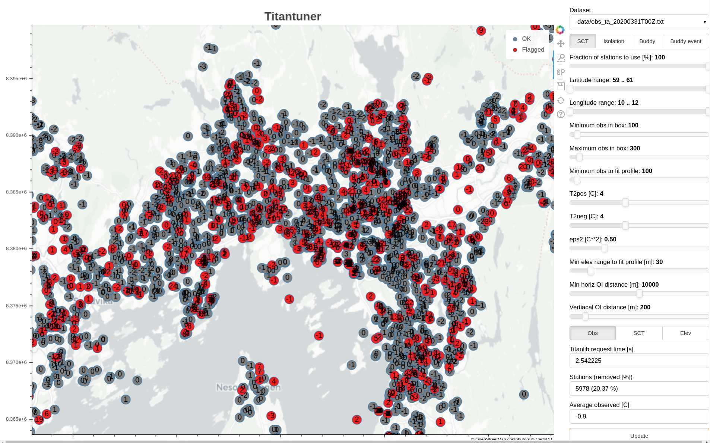

# Titantuner


## Installation

```bash
pip3 install -r requirements.txt
```

## Running titantuner

Create a `data/` folder and copy titan output from the PPI. Then run the following command:

```bash
./serve data
```

Or alternatively, run `serve` without arguments to use synthetic data.
