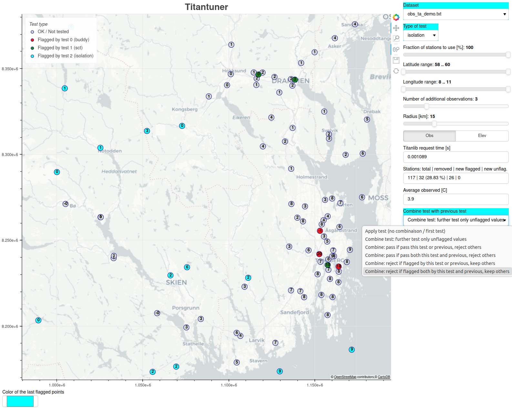

# Titantuner
The titantuner is a web interface for tuning the many parameters of quality control methods in [titanlib](https://github.com/metno/titanlib).



## Installation

Titantuner is available on pypi, and can be installed as follows:
```bash
pip3 install titantuner
```

To install from source, run the following in the root of this repository:
```bash
pip3 install .
```

## Running titantuner

```bash
titantuner [-p <port>] [-d <datadir>]
```
This starts a webserver locally on your computer, making the titantuner available in the browser. Use `-p` to
specify the port, otherwise it will appear on port 8081. Titantuner will load whatever data is available in
<datadir>. If this is not provided, then some sample data from Norwegian Synop stations are provided.

Select the test you want to perform (SCT, Isolation, Buddy, Buddy event, SCT resistant, SCT dual, First
Guess), and set the test parameters in the UI. Then click on the update button (below the parameters)
to see the map showing the results of the tests.

There is a demo data file to start right away using:

```bash
titantuner -d ./extras/*.txt
```

## Running titantuner on your own data

Titantuner can parse data files organzed as follows:

```
lon;lat;elev;value
9.4023;61.5308;928;3.1
10.6878;60.0513;360;2.6
```

where lat and lon are in degrees, elev in meters, and value is the measurement. Each row represents one
observation, and each file represents observations for one time. Put this file in a data directory and supply
this when starting titantuner:

```bash
titantuner -d <datadir>
```

## Using the autotune function (beta version)

Ongoing development. This function aims at finding optimized parameters for quality control methods. When
running the autotune function as it is, three parameters are optimized for the buddy check run on temperature
observations. These optimized parameters are the search radius, the minimum number of buddies a station can
have, and the variance threshold for flagging the station.

Example of usage:

```bash
./titantuner/autotune.py obs_ta_20230924T12Z.txt
```

With obs_ta_20230924T12Z.txt containing 5 columns of data (temperature values) following this format:

```
lat;lon;elev;value;prid;dqc
61.1697;10.4107;205.0;13.70;5;0
58.2968;8.4620;70.0;14.60;5;7
```
